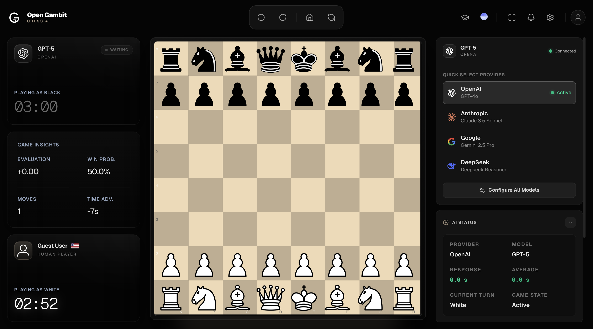
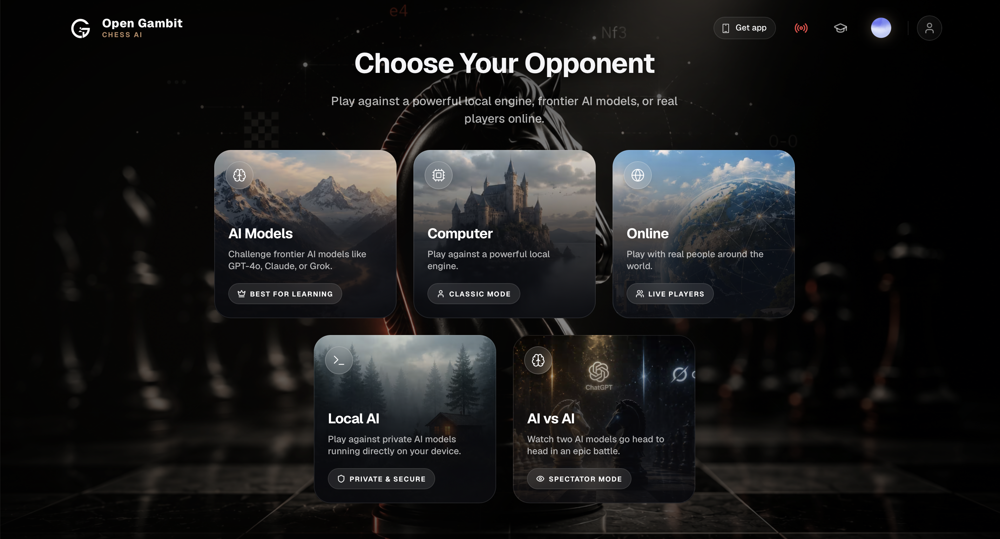
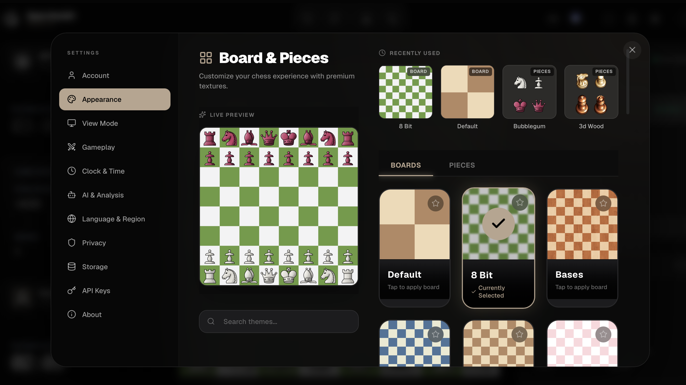
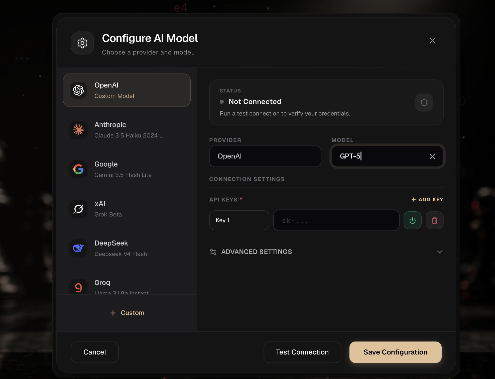

  

<h1 align="center">♟️ Open Gambit</h1>

  <em>Human Strategy. Machine Intelligence. One Board.</em>

  <strong>Main Dashboard:</strong> <a href="https://og-gambet.vercel.app">og-gambet.vercel.app</a> | <strong>Repo:</strong> <a href="https://github.com/sauravthakurq/main-og-open-gambet-v1">Dashboard Code</a> 
  <strong>Landing Page:</strong> <a href="https://ogopengambit.vercel.app">ogopengambit.vercel.app</a> | <strong>Repo:</strong> <a href="https://github.com/sauravthakurq/OG">Landing Page Code</a>

---

## 🖼️ Application Previews

  

  

  

  

  

  

  

  

---

## 📖 Overview

**Open Gambit** is a premium, AI-native chess operating system. Designed and developed entirely by **Saurav Thakur**, this platform explores the boundaries between human strategy and modern artificial intelligence. It acts not just as a game, but as an advanced interface to challenge the world's frontier AI models, learn from them, and compete globally.

## ✨ Key Features

### 🧠 The Ultimate AI Opponents
- **Play Against Frontier Models:** Challenge state-of-the-art models like GPT-4o, Claude 3.5, Gemini 1.5, and DeepSeek directly on the chessboard.
- **BYOK (Bring Your Own Key) & API Fallback:** Securely input your own API keys. The system includes an intelligent **API Key Fallback** mechanism—if one key hits a rate limit, it seamlessly switches to the next available key without interrupting your game.
- **AI vs AI Spectator Mode:** Select two different AI models (e.g., Claude vs GPT-4o) and watch them battle it out in real-time.

### 🛡️ Sovereign & Local Execution
- **Local AI (Ollama):** Run open-weights models entirely locally on your machine for zero-latency, offline, and completely private matches.
- **Strict Data Privacy:** By default, all your API keys are stored solely in your browser's encrypted local storage. You have the option to sync them securely via Firebase if you choose to sign in.

### 🎓 Gambit AI & Game Insights
- **Gambit AI Coach:** Your personal Grandmaster assistant. Analyze past games, ask strategic questions, and receive feedback to improve your gameplay. Adjustable personalities (Friendly, Strict, GM).
- **Real-Time Insights:** Track win probabilities, time advantages, and live evaluations during the match. Download your move list (PGN) instantly.
- **Learn:** Interactive documentation and interactive board tutorials designed for beginners to learn piece movements and basic strategies.

### 🌐 Global Connectivity
- **The Grandmasters:** View global leaderboards, FIDE ratings, and biographies of the chess elite.
- **Watch Live:** Spectate ongoing Grandmaster matches worldwide in real-time.
- **Online Multiplayer:** Create custom rooms and challenge your friends globally.

### ⚙️ Premium Interface & Settings
- **Visually Rich UI:** A distraction-free, glassmorphic dark theme built for intense focus.
- **Advanced Customization:** Toggle between 2D and 3D board views, configure time controls (Bullet, Blitz, Rapid, Classical), adjust AI temperature/token limits, and customize clock sounds.

---

## 🛠️ Architecture & Tech Stack

- **Framework:** Next.js (App Router), React
- **Styling & UI:** Tailwind CSS, Framer Motion
- **State Management:** Zustand
- **Chess Logic & Evaluation:** chess.js, Stockfish WebAssembly
- **AI Integrations:** Vercel AI SDK, OpenAI, Anthropic, Google Gemini, Ollama
- **Authentication & Sync:** Firebase

---

## 👨‍💻 Design & Development

This entire platform—from the UI/UX design to the complex AI architecture and frontend development—was crafted by **Saurav Thakur**.

💼 **LinkedIn:** [https://linkedin.com/in/sauravthakurq](https://linkedin.com/in/sauravthakurq)  
🌍 **Portfolio:** [https://sauravthakurx.vercel.app/](https://sauravthakurx.vercel.app/)  
💻 **GitHub:** [https://github.com/sauravthakurq](https://github.com/sauravthakurq)  
▶️ **YouTube:** [https://www.youtube.com/@SauravThakurx](https://www.youtube.com/@SauravThakurx)  
𝕏 **X (Twitter):** [https://x.com/SauravThakurx](https://x.com/SauravThakurx)  

---

## 📜 License

This project is open-source and available under the **MIT License**. See the [LICENSE](LICENSE) file for more information.

*Copyright © 2026 Saurav Thakur*
